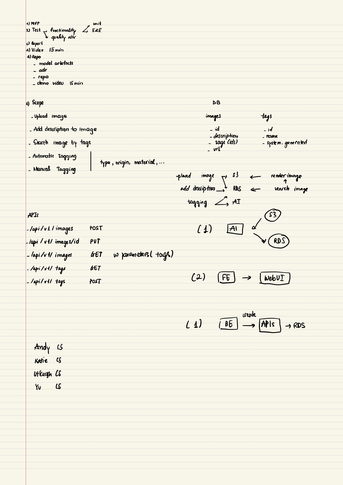

Discussion

1. Go through the project proposal:
2. Teammates:

Try to communicate with the other two teammates

3. Agree on weekly meeting schedule:

Weekly meeting after prac in Thursday

4. Deliverables:

* MVP
* Test
* Demo (15min)
* Report

5. Review Architecture Design

6. Next meeting: Thursday 2/5

